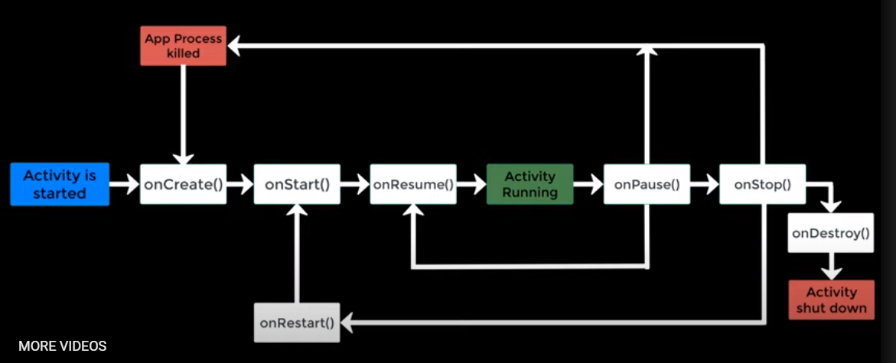

### Libraries Penting pada Android Development

-   android.app : Menyediakan Akses ke application model dan menjadi landasan pada **seluruh** Aplikasi Android
-   android.content : Memfasilitasi akses ke **Ke Konten , Publikasi , dan penukaran pesan** antar komponen aplikasi
-   android.database : Digunakan untuk akses data yang disediakan oleh **Penyedia Konten** dan **SQL lite database**
-   android.view : Fundamental **building blocks** untuk user interface
-   android.widget : Kumpulan **Pre-built** komponen User Interface, seperti **button,labels,layout\_managers,dll**
-   android.text : Digunakan untuk render dan **manipulasi text** pada perangkat display

### Android Frameworks key Services

-   **Activity Manager** : Control seluruh aspek aplikasi lifecycle dan tumpukan aktivitas
-   **Content Providers** : Membolehkan aplikasi untuk di publish dan membagikan data dengan aplikasi lain
-   **Resource Manager** : Menyediakan akses ke non code embedded resources seperti **String, color settings, dan user interface layouts.**
-   **Notifications Manager**: Membolehkan aplikasi untuk display **Alert atau notifikasi** kepada user

Anantomy of an Android application
----------------------------------

Aplikasi android dibentuk dengan cara mengabungkan satu atau lebih komponen yang dikenal dengan **Activities**

**Android Activities** Sebuah activity adalah standalone module dari **sebuah** fungsionalitas aplikasi Sebagai contoh , apabila memiliki apliaksi email, ada sebuah activity yang tugasnya untuk **Mengirim pesan** dant ada juga activity yang tugasnya untuk **Validasi Email**

#### Note untuk Android Activity

-   **onCreate()** : Inisiasi kebutuhan activity seperti variable dan komponen lainnya
-   **onStart()** : Dieksekusi sehingga activity dilihat oleh user
-   **onResume()** : Dieksekusi jika user berinteraksi dengan aplikasi
-   **onPause()**: Dieksekusi jika activity berjalan di latarbelakang / sedang digantikan oleh actvitiy lain
-   **onStop()** : Dieksekusi jika sistem kehabisan memori / diberhentikan oleh algoritma / sistem
-   **onDestroy() : Mengahapus seluruh resource activity yang ada**
-   **onRestart() : restart kembali activity**

**Android Fragments** Android fragment merepresentasikan satu buah user interface screen pada aplikasi. Best practicenya adalah memecah aktivitas kebeberapa fragment ,dalam kasus ini activity bertindak sebagai container yang berisi 1 sampai N fragments.

**Android intents**
 dahlah malrrr
